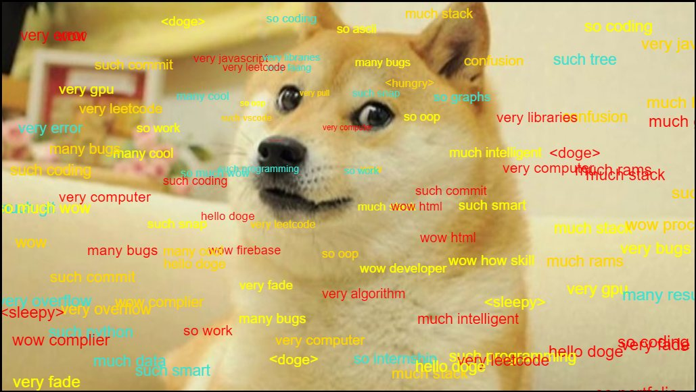

# Snap-Inc-Projects

Here are web and mobile projects that I completed during my time at Snap Inc. as a Snap Engineering Academy Scholar!

## Capstone Project

### Prototype Snapchat Feature "Unity By Snap" (React Native Expo, Google Firebase Firestore & Authentication)
GitHub: https://github.com/JonathanCNg/UnityBySnap

## Mini Projects

### Emotion Lens (p5.js, ml5.js, Google Teachable Machine)

GitHub: https://github.com/JonathanCNg/Emotion-Lens

### Programmer Doge (p5.js)

GitHub: https://github.com/JonathanCNg/Programmer-Doge

Live: https://jonathancng.github.io/Programmer-Doge/

### Seaside Bakery Webpage (HTML/CSS/JS)

GitHub: https://github.com/Snap-Engineering-Academy-2021/food-town

My Code: https://github.com/Snap-Engineering-Academy-2021/food-town/tree/main/jonathan

Live: https://snap-engineering-academy-2021.github.io/food-town/jonathan/index.html

