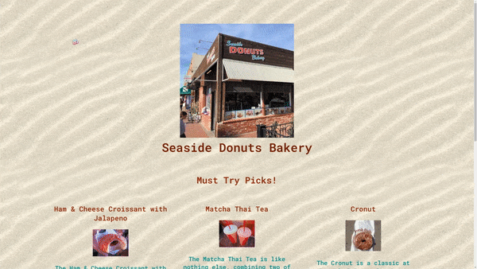

# Snap Inc. Projects

Here are web and mobile projects that I completed during my time at Snap Inc. as a Snap Engineering Academy Scholar! 👻👨‍🎓

## Capstone Project

### Prototype Snapchat Feature "Unity By Snap" ♥

~ | Welcome | Education | Non-Profit |
|---|---|---|---|
**Samples** |  |  |  |

**Tech**: React Native Expo, Google Firebase Firestore & Authentication

**GitHub**: https://github.com/JonathanCNg/UnityBySnap

## Mini Projects

~ | Emotion Lens | Programmer Doge | Seaside Bakery
:-------------------------:|:-------------------------:|:-------------------------:|:-------------------------:
**Sample** |  |  | 
**Tech** | p5.js, ml5.js, Google Teachable Machine | p5.js | HTML/CSS/JS
**GitHub** | [Emotion Lens Repo](https://github.com/JonathanCNg/Emotion-Lens) | [Programmer Doge Repo](https://github.com/JonathanCNg/Programmer-Doge) | Seaside Bakery Repo](https://github.com/Snap-Engineering-Academy-2021/food-town/tree/main/jonathan)
**Demo** | [Emotion Lens Demo](https://jonathancng.github.io/Emotion-Lens/) | [Programmer Doge Demo](https://jonathancng.github.io/Programmer-Doge/) | [Seaside Bakery Demo](https://snap-engineering-academy-2021.github.io/food-town/jonathan/index.html)
